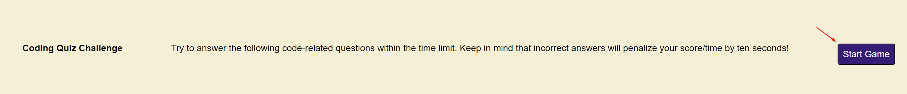
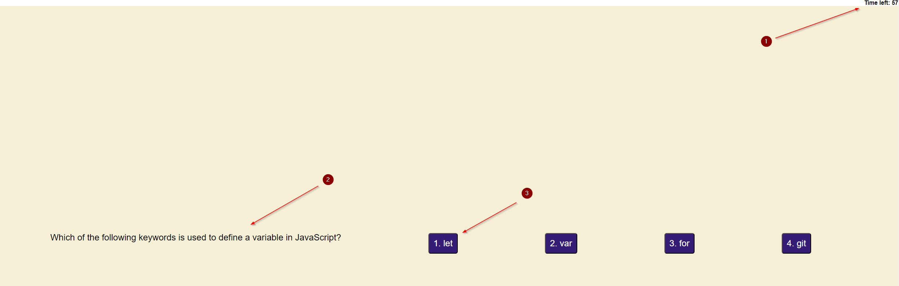
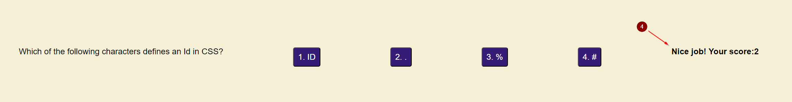

# Code-Quiz

This project was created to display a short 5 question quiz. The questions are based on basic front end knowledge. 

## Built with
This project is created with HTML, CSS, and Javascript

## Usage 
Landing page has a prompt with brief message of what happens during the quiz. "Start Game" button will begin the quiz and start the timer. Once the quiz has begun you will see the time on the top right begin. You will have 60 seconds to answer the question present using the 4 buttons that appear. Each incorrect answer will drop the timer by 10 seconds. Once you have gone through the questions, you'll be present with your high score at the end.

Pictures of expected behavior

## License
See the license [here](./LICENSE)

## Acknowledgements

[MDN website](https://developer.mozilla.org/en-US/)
[ChatGPT](https://chat.openai.com/)
[Site used for quiz questions](https://www.interviewbit.com/javascript-mcq/)
[Site used for quiz questions pt2](https://www.scribd.com/document/512954102/Multiple-Choice-Questions-on-HTML-CSS-Javascript-With-Answers#)